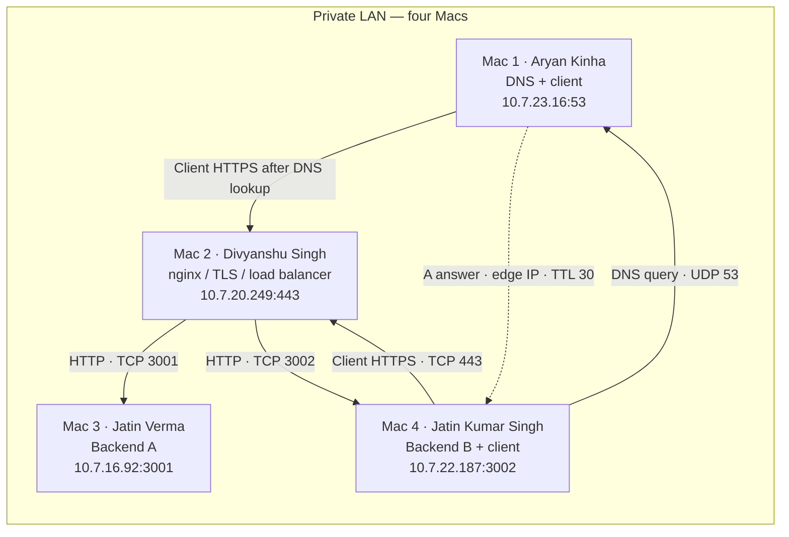

# Private Network Service Platform — Phase I

Computer Networks course project for four students on four macOS laptops. The backend stays simple; the project demonstrates DNS → TCP → TLS → HTTP, nginx load balancing, caching and packet analysis on a private LAN.

## Team and machine roles

| Mac | Member | Enrollment | Role | Private IP / service port |
| --- | --- | --- | --- | --- |
| 1 | Aryan Kinha | 2401020013 | Private DNS + test client | `10.7.23.16`, UDP/TCP 53 |
| 2 | Divyanshu Singh | 2401010161 | nginx edge, TLS termination, round-robin load balancer | `10.7.20.249`, TCP 80 / 443 |
| 3 | Jatin Verma | 2401010200 | Backend A | `10.7.16.92`, TCP 3001 |
| 4 | Jatin Kumar Singh | 2401010199 | Backend B + test client | `10.7.22.187`, TCP 3002 |

Mac 1 and Mac 4 can act as clients without adding a fifth laptop. Divyanshu, Jatin Verma and Jatin Kumar Singh use Aryan's DNS according to the team's confirmation. The final application is accessed by domain name.

## Architecture




`app.team.test` and `api.team.test` both resolve to the edge. TLS ends at nginx; the edge-to-backend links use plaintext HTTP. DNS is a separate lookup, not a proxy through which the application request travels.

## Verification status — 5 October 2026

A later [video-recording run](video/README.md) found working DNS/ping and Backend A, but Backend B and edge HTTPS timed out. The successful results below describe the earlier baseline. Current healthy operation was not re-established in the later run.

The final live smoke test passed with default client certificate trust and no insecure option. DNS, HTTP/HTTPS, A/B load balancing, cache headers and conditional 304 are verified from Aryan's Mac. Fresh Wireshark screenshots show DNS, the complete edge TCP handshake and a TLS 1.2 certificate/ChangeCipherSpec/encrypted application flow; the capture also contains TLS 1.3.

- Both names resolve to `10.7.20.249`, TTL 30. HTTP/1.1 and negotiated HTTP/2 both work.
- Six HTTPS requests returned **B, A, B, A, B, A**. Both backends' `/` and `/api/status` endpoints returned 200.
- Plain HTTPS validates the certificate and returns 200. Cache responses include `public, max-age=60`, ETag `"cn-cache-v1"`, and conditional 304.
- All three remote Macs use Aryan's DNS according to the team. Their resolver logs, full interface inventory and remaining pairwise ping directions are unverified.
- The five controlled failure demonstrations are not complete. Wrong-resolver and closed-port diagnostic probes are saved; backend stop/restart tests require remote service control, which is unavailable in this session.

The working service is verified, but the full Phase I evidence checklist remains incomplete. The LAN/edge showed intermittent timeouts before the final successful run. See the [full results report](docs/phase1-results.md), [final smoke output](evidence/phase1/latest-smoke-test-2026-10-05.md), and [evidence index](evidence/phase1/README.md).

## Phase I requirements

| Assignment task | What to demonstrate | Documentation |
| --- | --- | --- |
| A · LAN | Full interface/IP/prefix/gateway/MAC inventory; ping between every pair | [Architecture](docs/architecture.md) |
| B · DNS | Both private names; at least two other Macs use Mac 1 as resolver | [DNS guide](dnsmasq/README.md) |
| C · Backends | `/`, `/api/status`, `X-Backend`, LAN binding, ports 3001/3002 | [Runbook](docs/project-playbook-and-troubleshooting.md) |
| D · Edge | nginx upstreams and repeated responses from A and B | [Demo commands](docs/demo-commands.md) |
| E · TLS | Trusted HTTPS by name, no `curl -k`, handshake explanation | [TLS setup](docs/tls-setup.md) |
| F · Caching | Cache-Control and cache hit or conditional 304 | [Demo commands](docs/demo-commands.md) |
| G · Packets | DNS, complete TCP handshake, TLS, ports and HTTP headers | [Evidence](evidence/phase1/README.md) |

Section 6.3 also requires wrong DNS, wrong DNS answer, one backend stopped, both backends stopped, and wrong destination port. [Failure plan](docs/phase1-failure-tests.md) includes restoration steps. Backup DNS, firewall isolation and edge migration belong to Phase II and are outside this deliverable.

## Run and verify

On Mac 3: `./scripts/run-backend.sh A`. On Mac 4: `./scripts/run-backend.sh B`.

```bash
dig app.team.test
dig api.team.test
curl -v https://app.team.test/api/status
curl -I https://app.team.test/api/cache
curl -i -H 'If-None-Match: "cn-cache-v1"' https://app.team.test/api/cache
```

These HTTPS commands were verified from Aryan's Mac. HTTP/1.1 is required; HTTP/2 is optional if supported. HTTP/3 and email protocols are explanation-only.

## Files and evaluation

- [Full Phase I results](docs/phase1-results.md)
- [Architecture and inventory](docs/architecture.md)
- [Configuration and troubleshooting runbook](docs/project-playbook-and-troubleshooting.md)
- [TLS certificate installation](docs/tls-setup.md)
- [Demo commands](docs/demo-commands.md)
- [Submission checklist mapped to the assignment](docs/form-submission-checklist.md)
- [Team presentation script](docs/phase1-video-script.md)
- [Silent subtitled video and recording notes](video/README.md)
- [Evidence and screenshot guide](evidence/phase1/README.md)

The source assignment is `CN_Project_Doc.pdf`, Sections 3, 4, 6, 9 and Review 1 in Section 10. Review 1 totals 50 marks: 40 for the team and 10 for individual viva. Old cloned screenshots/logs and superseded diagnostic captures were removed during the Phase I cleanup. Final team evidence and historical text logs are retained. No five-minute video limit or specific submission form is imposed by the supplied PDF; confirm any additional faculty instructions separately.

## Smoke test

```bash
./scripts/smoke-test.sh team.test
# Explicit trust for the project certificate, while keeping hostname validation:
HTTPS_CA_CERT=tls/edge.crt ./scripts/smoke-test.sh team.test
```

The script checks DNS, existing HTTP requests, a verbose HTTPS request and HTTPS response headers. It exits on failures and prints success only after every request succeeds. [Latest smoke-test results](evidence/phase1/latest-smoke-test-2026-10-05.md).
