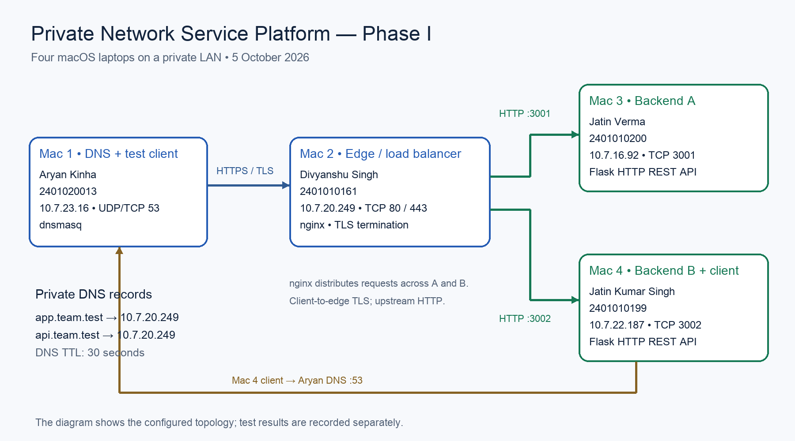
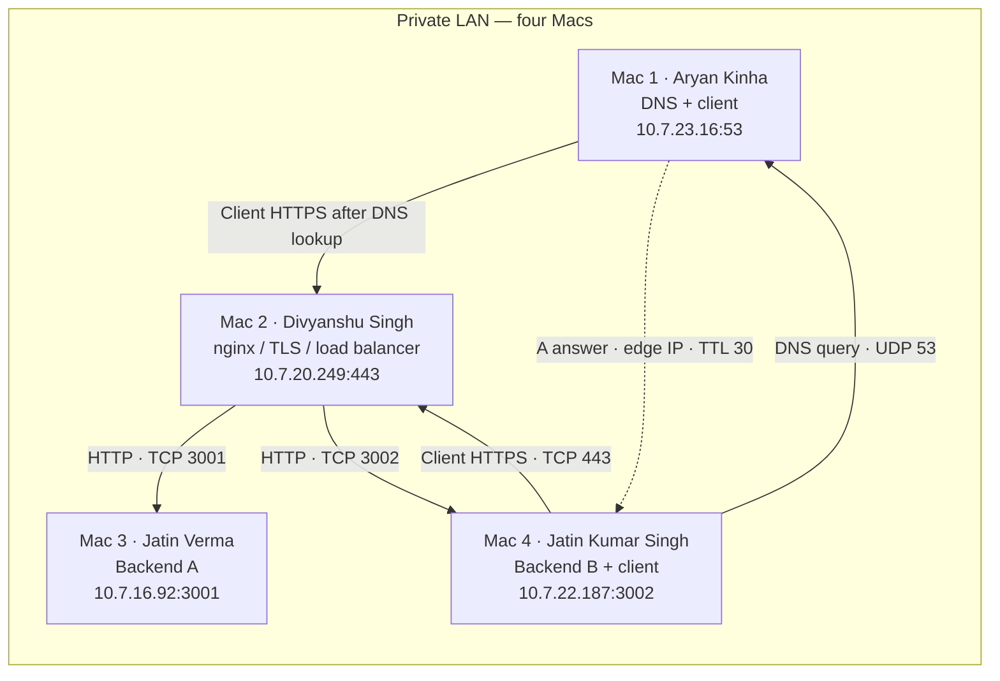

# Phase I architecture — four Macs

| Mac | Member | Enrollment | Role | Private IP / service port |
| --- | --- | --- | --- | --- |
| 1 | Aryan Kinha | 2401020013 | Private DNS + test client | `10.7.23.16`, UDP/TCP 53 |
| 2 | Divyanshu Singh | 2401010161 | nginx edge, TLS termination, round-robin load balancer | `10.7.20.249`, TCP 80 / 443 |
| 3 | Jatin Verma | 2401010200 | Backend A | `10.7.16.92`, TCP 3001 |
| 4 | Jatin Kumar Singh | 2401010199 | Backend B + test client | `10.7.22.187`, TCP 3002 |

## Network topology





All four addresses fall within Aryan's observed `10.7.0.0/19` network (mask `255.255.224.0`). The remote prefixes must still be checked rather than assumed. Hardware is limited to these four Macs; test-client roles are shared with service machines.

## LAN inventory

| Mac | IPv4 | Mask / prefix | Gateway | Active interface | MAC address | Source |
| --- | --- | --- | --- | --- | --- | --- |
| 1 | 10.7.23.16 | 255.255.224.0 /19 | 10.7.0.1 | en0 | 2e:a3:0c:b9:e7:1a | Local inspection, 5 October 2026 |
| 2 | 10.7.20.249 | Pending | Pending | Pending | Pending | Team-confirmed IP |
| 3 | 10.7.16.92 | Pending | Pending | Pending | Pending | Team-confirmed IP; live backend response |
| 4 | 10.7.22.187 | Pending | Pending | Pending | Pending | Team-confirmed IP; live backend response |

Run `ifconfig` and `route -n get default` on each Mac. Save results and ping each of the other three IPs. Local evidence proves Mac 1 reaches Macs 2–4; it does not prove all other pairs or their resolver settings.

## Request flow

```mermaid
sequenceDiagram
    actor Client as Client on Mac 1 or Mac 4
    participant DNS as Aryan · dnsmasq · 53
    participant Edge as Divyanshu · nginx · 443
    participant A as Jatin Verma · Backend A · 3001
    participant B as Jatin Kumar Singh · Backend B · 3002
    Client->>DNS: DNS A query for app.team.test (UDP)
    DNS-->>Client: 10.7.20.249; TTL 30
    Client->>Edge: TCP SYN (ephemeral source port)
    Edge-->>Client: TCP SYN-ACK
    Client->>Edge: TCP ACK
    Client->>Edge: TLS ClientHello
    Edge-->>Client: TLS server handshake and certificate
    Note over Client,Edge: Validate identity/trust and complete handshake
    Client->>Edge: Encrypted HTTP request
    Edge->>A: Plain HTTP request (round-robin)
    A-->>Edge: JSON + X-Backend A
    Edge-->>Client: Encrypted HTTP response
    Client->>Edge: Next HTTP request over TLS
    Edge->>B: Plain HTTP request
    B-->>Edge: JSON + X-Backend B
    Edge-->>Client: Encrypted HTTP response
```

The client-to-edge HTTPS flow and A/B backend responses were verified in the final rerun; the edge-to-backend path is defined by the supplied nginx configuration. Current verification status is tracked in the [evidence index](../evidence/phase1/README.md).

## Protocol and cloud-role map

| Protocol / component | TCP/IP or conceptual OSI role | Ports / behavior | Cloud analogy |
| --- | --- | --- | --- |
| DNS / dnsmasq | Application | UDP/TCP 53; maps both names to edge | Managed DNS such as Route 53 |
| HTTP / REST | Application | HTTP/1.1 required; HTTP/2 optional | Application API |
| TLS | Security between HTTP and TCP; often explained as OSI session/presentation | Client-to-edge confidentiality and authentication | TLS listener on a load balancer |
| TCP | Transport | Edge 443, backend 3001/3002; sequence/ACK, retransmission, receive window | Reliable transport |
| UDP | Transport | Ordinary DNS query/response | DNS transport |
| IPv4 | Network | Private LAN addressing | Private network |
| Ethernet / Wi-Fi | Link | Frames on the active interface; local DNS may use lo0 | Local access network |
| nginx | Application proxy | Round-robin, TLS termination; passive upstream failure handling | ALB / reverse proxy; not a configured CDN |

The client only needs the edge address. nginx independently opens upstream TCP connections to the two backends. DNS and the edge are single points of failure in Phase I. `max_fails`/`fail_timeout` are passive failure handling, not active health probes. A failed backend may yield retries or errors depending on nginx configuration and request type; report measured results.

## Edge configuration supplied by the team

Divyanshu's Mac 2 hosts the nginx listener and TLS files. [The config](../nginx/nginx.conf.template) uses `/Users/divyanshusingh/Desktop/Private-Network-Service-Platform-/tls/edge.crt` and `edge.key`, HTTP/2 on the HTTPS listener, and TLS 1.2/1.3. HTTP port 80 declares app.team.test; HTTPS port 443 declares both app.team.test and api.team.test. Backend A is Mac 3 and Backend B is Mac 4; swapped Mac-number comments in the supplied snippet were corrected without changing the upstream IPs or ports.
