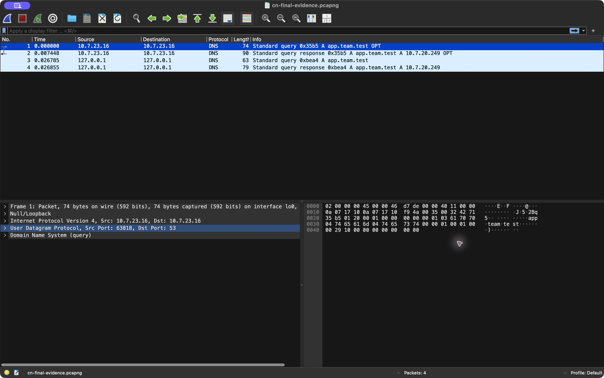
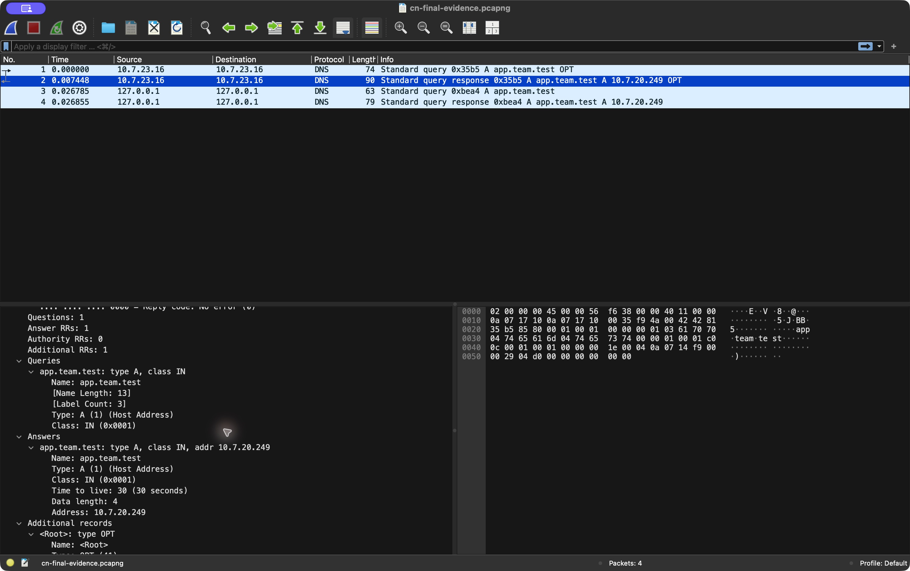
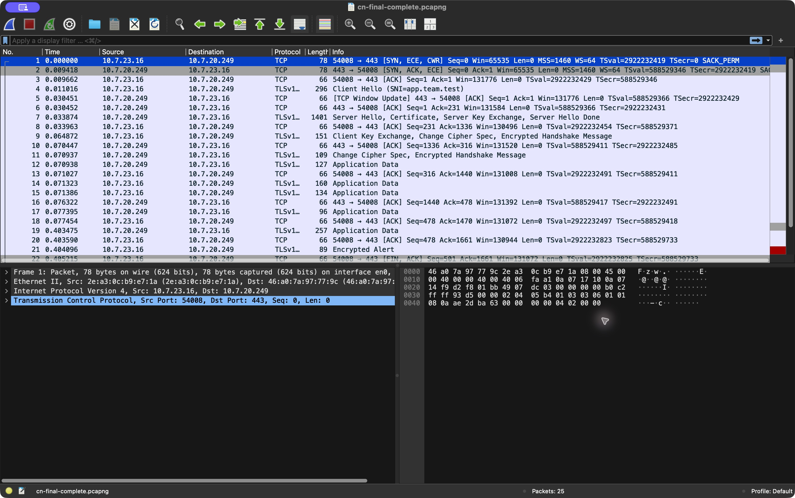
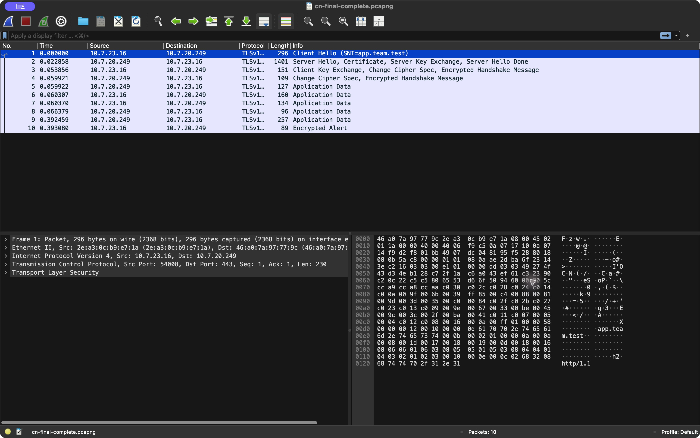

# Phase I evidence — current four-Mac team

Collected on Aryan Kinha's Mac on 5 October 2026. Names, enrollment numbers and roles match the [architecture](../../docs/architecture.md). See the [full results report](../../docs/phase1-results.md). Cloned evidence was removed during cleanup; only this team’s final captures, screenshots and actual text logs remain.

## Later video-recording run

The [new command/Wireshark video](../../video/README.md) records a later fresh command session. All three Macs answered ping and DNS resolved, but Backend B and edge HTTPS timed out; Backend A returned 200. [Actual command output](../../video/phase1-live-command-output.txt) and [timed terminal recording](../../video/phase1-live-terminal.cast) are preserved. The successful results below are the earlier baseline, not a claim that the later run succeeded.

## Earlier successful baseline

- [Final smoke test](latest-smoke-test-2026-10-05.md): DNS, five HTTP requests (B/A/B/A/B), HTTP headers, certificate-verified HTTPS and HTTPS headers; exit 0 using default client trust.
- [Full rerun](final-verification-2026-10-05.md): both DNS names/TTL 30, HTTPS B/A/B/A/B/A, TLS, HTTP/1.1, HTTP/2, api domain, direct backends, local inventory and ping. Edge ping had 50% loss in this two-packet sample; both backends had 0% loss.
- [Latest root/cache checks](latest-root-cache-2026-10-05.md): default-trust HTTPS root 200, cache headers 200, ETag and conditional 304.
- [Successful captured requests](last-capture-requests-2026-10-05.md): default-trust TLS 1.2 and TLS 1.3 requests returned 200 from B and A.
- [Certificate and config checks](tls-artifact-verification.md): SANs, dates, fingerprint, matching key and local nginx syntax verification. The team subsequently supplied the edge config and the repository template was synchronized; an independent nginx -T export is unavailable.
- [Negative probes](negative-probes-2026-10-05.md): public-resolver NXDOMAIN and closed-port refusal. These are diagnostic probes, not proof of all five controlled failure scenarios.

[Updated edge configuration validation](nginx-config-update-2026-10-05.md) records the supplied configuration and successful local syntax check.

## Primary packet capture

[phase1-final-flow.pcapng](phase1-final-flow.pcapng) contains 58 real packets: DNS, an established edge TCP/TLS 1.2 stream, and an established TLS 1.3 stream. Frame numbers below refer to this complete file. Simultaneous interface capture can interleave DNS and TCP observations; the client may also have a cached DNS answer.

| Full-file frames | Observation | Socket / detail |
| --- | --- | --- |
| 1 / 9 | DNS query/response, transaction 0xa7f5 | Aryan DNS port 53; app.team.test → 10.7.20.249, TTL 30 |
| 10 / 12 | Loopback DNS query/response, transaction 0x0ca3 | 127.0.0.1; client and DNS run on the same Mac |
| 2 / 3 / 4 | TCP SYN / SYN-ACK / ACK | 10.7.23.16:54008 ↔ 10.7.20.249:443, stream 0; relative Seq/Ack become 1/1 |
| 5 | TLS 1.2 ClientHello | SNI app.team.test |
| 8 | ServerHello, Certificate, ServerKeyExchange, ServerHelloDone | Visible certificate in a full TLS 1.2 handshake |
| 13 / 15 | Client/server ChangeCipherSpec and encrypted handshake | Completion of TLS 1.2 handshake |
| 16, 18, 19, 21, 23 | TLS 1.2 encrypted application records | HTTP headers are shown in curl logs, not read from ciphertext |
| 27 / 31 / 32 | Second complete TCP handshake | Client port 54010, edge port 443, stream 1 |
| 33 / 36 | ClientHello / TLS 1.3 ServerHello | Subsequent handshake messages, including certificate, are encrypted |
| 43 / 44 / 47–49 | Retransmission and duplicate ACK observations | Retained as real transport evidence; do not infer a definitive cause |

Filters in the full file: `tcp.stream == 0`, `tcp.stream == 0 && tls`, `tcp.stream == 1`, and `dns.qry.name == "app.team.test"`. TLS 1.3 compatibility ChangeCipherSpec does not indicate key activation.

## Four reviewed Wireshark screenshots

Screenshots come from actual Wireshark windows and were visually inspected. Read filters reduce the opened packet set and renumber the displayed frames; use the full-file table above for primary capture frame references.

### DNS query and response

### Expanded DNS answer and TTL

Both DNS screenshots use [phase1-dns-edge-timeout.pcapng](phase1-dns-edge-timeout.pcapng), transaction 0x35b5, client port 63818. DNS succeeded during this session even though the edge connection subsequently timed out. These screenshots prove the DNS answer, not successful HTTPS from that earlier capture.

### Complete edge TCP handshake

Read filter `tcp.stream == 0` in the primary final capture. Displayed first three frames correspond to full-file frames 2/3/4. Both endpoints, client source port 54008 and destination port 443 are visible.

### TLS handshake and encrypted records

Read filter `tcp.stream == 0 && tls` in the primary capture. Visible ClientHello/SNI, ServerHello/Certificate, ChangeCipherSpec and encrypted application records correspond to full-file frames 5, 8, 13, 15 and subsequent records.

## Earlier setup and intermittent failures

[Initial checks](live-verification-2026-10-05.md), [early HTTPS retry](working-verification-2026-10-05.md), [HTTP checks](http-verification-2026-10-05.md), and [earlier certificate-trust smoke test](https-smoke-test-2026-10-05.md) document setup failures. The default trust failure in the earlier smoke log was resolved by the final run.

[Captured attempts](captured-requests-2026-10-05.md), [TLS retry](tls-capture-retry-2026-10-05.md), and [failed smoke attempt](smoke-final-attempt-2026-10-05.md) preserve intermittent timeouts before final recovery. Superseded initial/HTTP/TLS-retry captures and the additional direct-backend screenshot were removed. `phase1-dns-edge-timeout.pcapng` is retained because it is the source of the two DNS screenshots. Unfiltered local captures were removed; future raw captures remain ignored by Git.

## Evidence still unavailable

Full remote interface/prefix/gateway/MAC inventory; remaining all-pairs ping directions; default-resolver logs on at least two other Macs; browser/other-client certificate trust; the actual loaded edge config export; and complete five controlled failure demonstrations. This session has no authenticated remote control of the other Macs. Team confirmation is recorded separately from direct observation. The working service passes the final checks, while the full assignment evidence is incomplete.
