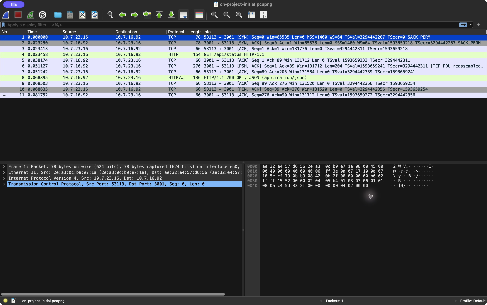

# Phase I evidence — current four-Mac team

Collected on Aryan Kinha's Mac on 5 October 2026. Addresses and roles match the [architecture](../../docs/architecture.md). Original cloned evidence is separately labeled in [reference-original](../reference-original/README.md) and is not submission proof.

## Latest HTTPS smoke test

[Updated smoke-test results](https-smoke-test-2026-10-05.md): port 443 now works with the installed project certificate, TLS 1.3 and HTTP/2. Explicit certificate trust passes hostname validation and returns A/B responses. The default trust store still fails (exit 60); system/browser trust is pending. Earlier failures below are historical setup results.

## Actual command output

- [Initial verification](live-verification-2026-10-05.md): both DNS names resolve with TTL 30, default local DNS is used, Backend A and Backend B return the correct identifiers, and Mac 1 can ping Macs 2–4. HTTPS failed before the edge listener was enabled.
- [HTTPS retry](working-verification-2026-10-05.md): actual connection-refused results on port 443. The file's original title describes a retry session, not successful HTTPS evidence.
- [HTTP and root endpoint checks](http-verification-2026-10-05.md): direct `/` endpoints return HTTP 200 from A and B. Subsequent edge HTTP requests timed out; no successful balancing/cache result is inferred from these attempts.
- [Certificate/configuration verification](tls-artifact-verification.md): generated certificate's names, validity and fingerprint, matching private key, hostname verification, and local nginx configuration test.

A single HTTP request through nginx on 80 returned HTTP 200 and X-Backend B during diagnosis. Later attempts timed out during setup. This is not proof of repeated A/B distribution or caching.

## Saved project-only captures

- [Initial DNS and backend flow](phase1-project-initial.pcapng): 34 packets, including both private DNS names, unsuccessful edge HTTPS connections and successful direct backend connections. This is not a completed DNS→edge TCP→TLS→HTTP flow.
- [HTTP retry capture](phase1-http-flow.pcapng): project DNS and attempted edge HTTP traffic during setup; inspect actual responses rather than assuming success.

Unfiltered local captures are kept out of the submission bundle in the ignored `evidence/local-raw/` directory. Captures and screenshots were collected from real traffic; packet numbers below refer to the initial project-only file.

## DNS packet analysis

| Frames | Query / response | Client / server | Result |
| --- | --- | --- | --- |
| 1 / 2 | app.team.test, transaction 0x78ef | 10.7.23.16:60237 → 10.7.23.16:53 and reverse | A = 10.7.20.249; TTL 30 |
| 3 / 4 | api.team.test, transaction 0xda1f | Local query to Aryan's DNS | A = 10.7.20.249; TTL 30 |
| 5 / 6 and 7 / 8 | app.team.test | Loopback 127.0.0.1 | Edge address returned |

Filter: `dns.qry.name == "app.team.test"` or `dns.qry.name == "api.team.test"`. Local DNS is captured on lo0 because this client is also the DNS host. A remote-client capture or plain dig/scutil logs from the other Macs are still needed to substantiate their configured resolver behavior.

The screenshot uses an app.team.test read filter, so Wireshark renumbers the reduced view; the first query/response pair still corresponds to frames 1/2 in the full saved project file. An expanded DNS answer/TTL screenshot remains to be saved; the actual TTL is available in the capture and dig output.

## TCP packet analysis

Backend A: frame 13 SYN, frame 14 SYN-ACK, frame 15 ACK. Socket pair: `10.7.23.16:53113` ↔ `10.7.16.92:3001`. Relative sequence/ACK numbers progress 0 → 1 during establishment; subsequent data is plain HTTP. Filter: `tcp.stream eq 2` in the initial project file.

This screenshot uses a stream read filter; displayed frames 1/2/3 correspond to full-file frames 13/14/15. It proves a direct backend connection, not the still-pending edge HTTPS handshake.

The failed edge flow is frame 9 SYN then frame 10 RST-ACK, socket pair `10.7.23.16:53109` ↔ `10.7.20.249:443`. Frames 11/12 show the same refusal on 8443. No SYN-ACK/established connection or TLS handshake follows those attempts.

## Remaining required evidence

- Full edge TCP SYN→SYN-ACK→ACK before a successful TLS handshake.
- TLS ClientHello/ServerHello, certificate and ChangeCipherSpec where visible, plus encrypted application records. Use a fresh full TLS 1.2 handshake to show the visible certificate; a normal TLS 1.3 certificate is encrypted after ServerHello.
- Trusted HTTPS by domain name without bypassing certificate verification; client trust-store/browser evidence.
- Repeated edge responses with both backend identifiers; live Cache-Control and conditional 304/cache hit.
- Remote LAN inventory and resolver logs, plus ping between every machine pair.
- All five [controlled failure scenarios and recovery](../../docs/phase1-failure-tests.md).

Use [the demo commands](../../docs/demo-commands.md) after [installing TLS](../../docs/tls-setup.md). Do not reuse the old team's screenshots or claim missing events from failed connections. Wireshark's automation intermittently lost its window during attempts to expand the DNS answer; the saved screenshots above were successfully captured and reviewed.
